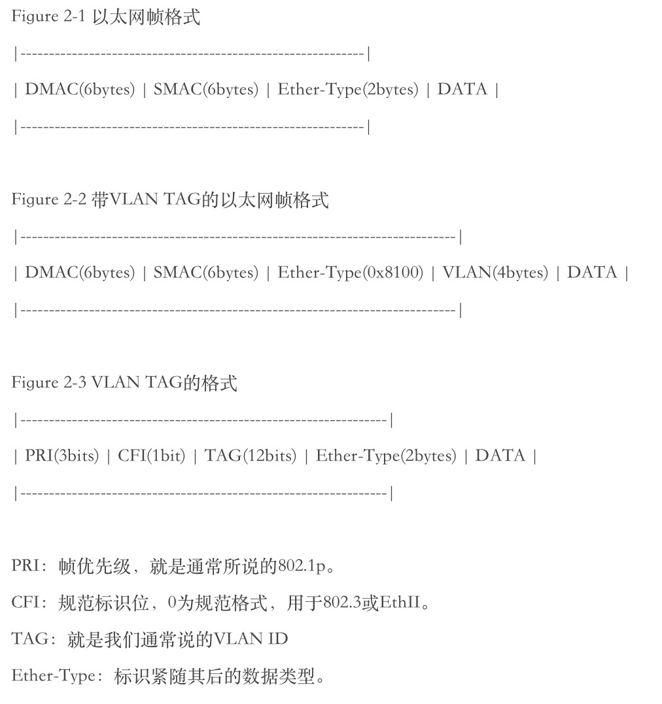
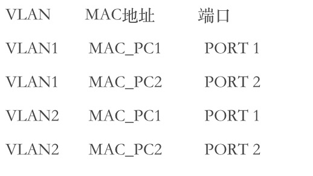

# [**802.1Q VLAN**] (https://blog.csdn.net/xiaohaijiejie/article/details/70208549)

 在数据通信和宽带接入设备里，只要涉及到二层技术的，就会遇到VLAN。而且，通常情况下，VLAN在这些设备中是基本功能。所以不管是刚迈进这个行业的新生，还是已经在这个行业打拼了很多年的前辈，都要熟悉这个技术。在论坛上经常看到讨论各种各样的关于VLAN的问题，在工作中也经常被问起关于VLAN的这样或那样的问题，所以，有了想写一点东西的冲动。大部分童鞋接触交换这门技术都是从思科技术开始的，讨论的时候也脱离不了思科的影子。值得说明的是，VLAN是一种标准技术，思科在实现VLAN的时候加入了自己的专有名词，这些名词可能不是通用的，尽管它们已经深深印在各位童鞋们的脑海里。本文的描述是从基本原理开始的，有些说法会和思科技术有些出入，当然，也会讲到思科交换中的VLAN。

## 1.以太网交换原理

 VLAN的概念是基于以太网交换。所以，为了保持连贯性，还是先从交换原理讲起。不过，这里没有长篇累牍的举例和配置，都是一些最基本的原理。 本节所说的以太网交换原理，是针对‘传统’的以太网交换机来说的。所谓‘传统’，是指不支持VLAN。简单的讲，以太网交换原理可以概括为‘源地址学习，目的地址转发’。考虑到IP层也涉及到地址问题，为了避免混淆，可以修改为 ‘源MAC学习，目的MAC转发’。从语文的语法角度来讲，可能还有些问题，就再修改一下 ‘根据源MAC进行学习，根据目的MAC进行转发’。总之，根据个人习惯了。本人比较喜欢 ‘源MAC学习，目的MAC转发’的口诀。

 

 简单描述一下PC1 ping PC2的过程：（这里假设，PC1和PC2位于同一个IP网段，IP地址分别为IP_PC1 和 IP_PC2，MAC地址分别为 MAC_PC1 和 MAC_PC2 ）

 1) PC1首先发送 ARP 请求，请求 PC2 的 MAC。目的 MAC=FF:FF:FF:FF:FF:FF(广播)；源 MAC = MAC_PC1。SW1 收到该广播数据帧后，根据帧头中的源MAC地址，首先学习到了PC1的MAC，建立MAC地址表如下： 

                           MAC地址             端口
                           MAC_PC1             PORT 1

 2) 由于ARP请求为广播帧，所以，SW1向除了 PORT1 之外的所有UP的端口广播。注意，该帧没有任何变化。换句话说，交换机没有对帧做任何修改。这就是传说中的透明传输。

 3) PC2收到该ARP请求帧，本地建立ARP表项，同时单播回送ARP应答帧。目的 MAC= MAC_PC1；源MAC=MAC_PC2。SW1收到该单播帧手，根据帧头中的源MAC地址，学习到了PC2的MAC，建立MAC地址表如下：    
                           
                           MAC地址             端口
                           MAC_PC1             PORT 1
                           MAC_PC2             PORT 2

 4) SW1根据帧头中的目的MAC地址 (MAC_PC1)将数据帧从PORT 1转发。
 
 5) PC1收到ARP响应，ARP交互过程成功。接下来进行单播PING包交互。SW1根据数据帧的目的MAC进行透明转发单播帧，同时刷新本地MAC地址表的老化定时器。

## 2. 802.1Q VLAN的基本原理：

 严格来说，802.1Q VLAN不是一个协议，因为互连的设备之间没有协议层面的报文交互。802.1Q VLAN只定义了数据帧的封装格式，即，在以太网帧头中插入了4个字节的VLAN字段。其主要内容为VLAN TAG，紧随其后的数据类型和802.1p报文优先级的标识。

 

  本人所理解的VLAN技术要点主要有两点：1.支持VLAN的交换机的内部交换原理；2.设备之间交换机之间，交换机与路由器之间，交换机与主机之间)交互时，VLAN TAG的添加和移除。下面就按照这个思路来描述。

###2.1 支持VLAN的交换机的交换原理
  引入VLAN概念后，数据帧只在相应的VLAN进行交换。用通俗一点的话来讲，一个交换机被虚拟出了多个逻辑交换机，每一个VLAN内的端口都是一个逻辑上的交换机。用专业一点的话来讲，一个交换机被划分了多个不同的广播域，每一个VLAN内的端口，在同一个广播域内。
  引入VLAN后的交换原理与传统的交换原理相比，并没有本质上的改变，同样遵循‘源MAC学习，目的MAC转发’的基本原则。唯一不同的是，学习和转发都只在同一个VLAN中进行，数据帧不能跨VLAN交换或转发。(一个VLAN就是，一个交换机，划分一个vlan内的主机是可以通过二层交换访问到)
 
####2.1.1 数据帧该在哪个VLAN中进行交换？
  前面提到，支持VLAN的交换机将数据帧限制在同一个VLAN中进行交换，那么数据帧到底该在哪个VLAN中交换呢？如果收到的数据帧携带了VLAN信息 （通常称为’TAGED数据帧‘，前面已经介绍了带VLAN TAG的以太帧格式），该VLAN信息中的VLAN TAG就是交换该帧的VLAN。
  如果收到的数据帧没有携带VLAN信息（通常称为‘UNTAGED’数据帧），收到该帧的端口的PVID就是交换该帧的VLAN。
  该规则在2.2.3节中有详细的描述。
  根据上面的原则，也定义了PVID的概念。当端口收到一个UNTAGED数据帧时，无法确定在哪个VLAN中进行交换，PVID定义了在这种情形下交换该帧的VLAN。从某种意义上讲，可以把PVID理解为端口的default VLAN。在支持VLAN的交换机中，每个端口都有一个PVID值，该值有一个缺省值，当然你也可以更改它。
 
####2.2.2 MAC地址学习和MAC地址表
  引入VLAN概念后，MAC地址的学习也在相应的VLAN中进行。从某种意义上理解，一台交换机有多张MAC地址表，每个VLAN一张表，在交换数据帧进行查表时，只需要在相应的VLAN中进行查找。很显然，MAC地址表项中，增加了VLAN TAG属性。

 
 

###2.2 VLAN TAG的添加和移除规则
  为了保证设备之间的互联互通，需要理解VLAN TAG的添加和移除规则。也就是说，交换机在转发数据帧时，什么时候应该打TAG，什么时候应该不打TAG，什么时候又会丢弃数据帧。
  为什么要有这么‘复杂’（其实也没那么复杂）的规则呢？为什么不把所有的数据帧都打上TAG呢，这样不是简单多了？其实，这样做也是为了适应不同设备的工作原理，有些设备是不支持VLAN TAG的。
 
####2.2.1 典型设备
  先介绍一下几种典型的设备：PC：大部分的PC（专用的，或用于测试的除外）是工作在应用层的，缺省情况下是不支持(其实也不需要)VLAN TAG的。也就是说，PC发出的都是UNTAGED数据帧。
  
  Router：路由器是支持VLAN TAG的。也就是说，路由器可以发出TAGED数据帧，也可以发出UNTAGED数据帧。需要说明的是，路由器是处理数据包的三层信息的，对于二层信息（包括VLAN信息），路由器只是检查其有效性，之后将其剥离。这个过程就是我们常说的‘终结’，也就是说，路由器会终结掉报文的VLAN信息的。
  
  Switch：这里的switch是指以太网交换机。VLAN技术就是主要针对于交换机提出的，所以，在讨论VLAN概念时都是立足于交换机来讨论。很显然，交换机既支持收发TAGED数据帧，也支持收发UNTAGED数据帧。从严格意义上讲，引入VLAN后，交换机的行为不再是‘透明传输’，因为数据帧经过交换机后可能发生了变化。
 
  了解了几种典型设备的工作原理后，就应该觉得交换机上TAG的添加和移除原则的必要性了。
 
####2.2.2 VLAN中的端口属性
  一个VLAN可以包含多个端口，而一个端口也可以属于多个VLAN。一个端口在一个VLAN中有不同的属性，TAG的添加和移除原则就是根据这个属性而定的。
  TAGED：如果一个端口在一个VLAN中的属性是TAG的，那么，从该端口转发出去的数据帧就是TAGED。（当然，该数据帧是在该VLAN中交换的）
  UNTAGED：如果一个端口在一个VLAN中的属性是UNTAG的，那么，从该端口转发出去的数据帧就是UNTAGED。（当然，该数据帧是在该VLAN中交换的）
  
2.2.3 交换机收发数据帧的处理总结
  我们分几种情况讨论交换机的接收和发送处理：接收端口和发送端口在VLAN中属性；收到的数据帧是TAG的还是UNTAG的。
  1). 端口接收到数据帧
    a). 如果是TAG的数据帧，检查该接收端口是否在该VLAN(数据帧中所携带的VLAN TAG)中
    - 接收端口在该VLAN中，则在该VLAN中根据交换原理(即，'源MAC学习，目的MAC转发'的原理)交换该数据包
    - 接收端口不在该VLAN中，丢弃该数据帧
    b). 如果是UNTAG的数据帧，检查该接收端口是否在某个VLAN中的属性是UNTAG
    - 接收端口在某个VLAN中的属性是UNTAG的，则在该VLAN中根据交换原理交换该数据包
    - 接收端口在任何VLAN中的属性都不是UNTAG的，丢弃该数据包
    注：根据这个原理可知，一个端口最多在一个VLAN中的属性是UNTAG的，否则，收到一个UNTAG的数据帧之后，就无法确定在哪个VLAN中进行交换。其实，端口UNTAG所在的VLAN，就是2.1.1节中所提到的PVID的概念。

  2). 端口发送数据帧
    a).检查该端口在该VLAN(就是交换该数据帧的VLAN)中的属性
    - 该端口在该VLAN种的属性是TAG的，发送的数据帧为TAG的数据帧
    - 该端口在该VLAN种的属性是UNTAG的，发送的数据帧为UNTAG的数据帧
    注：由于数据已经被交换到该端口，说明该端口肯定在该VLAN里。

####2.2.4 典型配置
  简单介绍一下，交换机连接不同典型设备时的常用配置。
         
  1). 连接PC
  上面介绍了在通常情况下，PC只支持收发UNTAG的数据帧，所以，连接PC的端口只需要加入一个VLAN，而且，在该VLAN中的属性为UNTAG。
  
  2). 连接Router
  路由器既支持收发TAG数据帧，也支持收发UNTAG数据帧。通常情况下，不同的VLAN数据帧都能通过该端口与路由器互通。所以连接路由器的端口可以属于多个VLAN，而且，只能在一个VLAN中的属性是UNTAG的，在其他的VLAN中都是TAG的。
  
  3). 连接Switch
  也就是交换机的级联。通常情况下是不同性能的交换机进行级联。这种情况和连接路由器的情况基本相同。
  
####2.2.5 思科交换机的端口类型
  TAG和UNTAG应该是一般性的说法，但讨论路由交换技术时，不能忽略思科技术，因为它毕竟是这个行业的引导者(你也可以说它是先入为主)。通常情况下，理解VLAN的概念都是以VLAN为立足点，然后将端口加入该VLAN，并赋予端口某种属性。这种思路似乎不适用于思科的交换技术。在思科的交换机上，都是以端口为立足点的，然后配置该端口的类型和所属的VLAN。
  
  这里介绍思科的两种端口类型，Access和Trunk。理解了这两种类型，也就理解了思科交换的VLAN基本原理。
  
  1). Access端口
  思科的Access端口是为了连接PC（终端设备）而设计的。由于大部分终端设备都不支持(其实也不需要)VLAN TAG的，所以连接终端设备的端口只需要在一个VLAN中，而且是UNTAG的。Access端口就是这样的。
  如果将端口配置为Access模式，该端口就只能在一个VLAN中(也就是Access VLAN)，而且该端口在该VLAN中的属性是UNTAG的。从某种意义上说，该VLAN也就是该端口的PVID。
  
  2). Trunk端口
  思科的Trunk端口是为了连接上行设备(路由器，交换机等支持多VLAN的设备)。通常情况下，上行端口需要汇聚多个VLAN的流量，所以该端口应该属于多个VLAN。
  如果将端口配置为Trunk模式，该端口可以属于多个VLAN，在思科技术中，习惯称该端口可以允许多个VLAN通过。该端口在一个VLAN中是UNTAG的，也就是该端口的PVID，在思科技术中，称为Native VLAN。该端口在其他的VLAN中都是TAG的。
  可以说，思科在VLAN的一般性原理上多增加了一层开发。如果理解了其本质原理，可以看出是和2.2.3节完全吻合的。
  
###2.3 交换机对VLAN的支持的发展历程
  从技术发展为产品总是需要一个过程，在接触过早期交换机的童鞋们应该会知道，当时的交换机对VLAN的支持有两种模式，SVL和IVL。
  
  SVL: Shared VLAN Learning 共享式VLAN学习
  IVL: Independent VLAN Learning 独立VLAN学习
  从通俗而简单的角度来说，IVL就是每个VLAN有一个MAC-端口映射表，同一个MAC可以出现在多个表里面(也就是不同的VLAN里面)；而SVL是在交换机内建一张大表，映射关系是MAC-VLAN-端口，而且，一个MAC在表中只出现一次，只属于一个VLAN。
  显然，SVL应该更容易实现一点，看起来是一种打补丁的实现方式，貌似不是真正的VLAN。早期的VLAN交换机中，有很多是SVL模式的。
  我们前面2.1和2.2节所介绍的原理，都是针对IVL来讲的。
  
  从网络上看到一位仁兄从专业的角度上总结了SVL和IVL的工作原理，非常准确而精辟，故我就不再加以润色，直接引用了。
  IVL，网上大部分资料都说为每个VLAN建一个表，看起来好像有很多表，其实这里所说的表是指逻辑上的表，实际上在交换机中还是只有一个表，如果将VID相同的记录都提取出来组成一个表，那么就一个物理上的表在逻辑上就可以认为是多个表了。
  
####2.3.1 IVL (Independent VLAN Learning)
  在MAC表中以MAC＋VID为主键进行储存。这样，同一个MAC就可能由于VID的不同而在MAC表中存在多条记录。
  1).根据MAC＋VID在MAC表中寻找，找不到转3)
  2).向找到的port转发packet，end.
  3).向packet携带的vid对应的整个VLAN的port转发，end.
 
####2.3.2 SVL(Shared VLAN Learning)
  在MAC表中以MAC为主键进行储存，也就是说同一个MAC在SVL方式下只能存在一个记录在MAC表中。
  1).在MAC中先根据MAC寻找相应的记录，找不到转4)
  2).记录中的VID与packet中携带的VID一样，得到相应的port；不一样转5)
  3).将packet转发到相应的port，end.
  4).向packet携带的vid对应的整个VLAN的port转发，end.
  5).drop，end.
