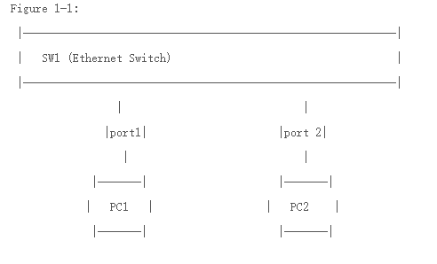

# 802.1Q VLAN
=============

在数据通信和宽带接入设备里，只要涉及到二层技术的，就会遇到VLAN。而且，通常情况下，VLAN在这些设备中是基本功能。所以不管是刚迈进这个行业的新生，还是已经在这个行业打拼了很多年的前辈，都要熟悉这个技术。在论坛上经常看到讨论各种各样的关于VLAN的问题，在工作中也经常被问起关于VLAN的这样或那样的问题，所以，有了想写一点东西的冲动。大部分童鞋接触交换这门技术都是从思科技术开始的，讨论的时候也脱离不了思科的影子。值得说明的是，VLAN是一种标准技术，思科在实现VLAN的时候加入了自己的专有名词，这些名词可能不是通用的，尽管它们已经深深印在各位童鞋们的脑海里。本文的描述是从基本原理开始的，有些说法会和思科技术有些出入，当然，也会讲到思科交换中的VLAN。

## 1.以太网交换原理
--------------
     VLAN的概念是基于以太网交换。所以，为了保持连贯性，还是先从交换原理讲起。不过，这里没有长篇累牍的举例和配置，都是一些最基本的原理。 本节所说的以太网交换原理，是针对‘传统’的以太网交换机来说的。所谓‘传统’，是指不支持VLAN。
     简单的讲，以太网交换原理可以概括为‘源地址学习，目的地址转发’。考虑到IP层也涉及到地址问题，为了避免混淆，可以修改为 ‘源MAC学习，目的MAC转发’。从语文的语法角度来讲，可能还有些问题，就再修改一下 ‘根据源MAC进行学习，根据目的MAC进行转发’。总之，根据个人习惯了。本人比较喜欢 ‘源MAC学习，目的MAC转发’的口诀。

 

     简单描述一下PC1 ping PC2的过程：（这里假设，PC1和PC2位于同一个IP网段，IP地址分别为IP_PC1 和 IP_PC2，
     MAC地址分别为 MAC_PC1 和 MAC_PC2 ）

     1) PC1首先发送 ARP 请求，请求 PC2 的 MAC。目的 MAC=FF:FF:FF:FF:FF:FF(广播)；源 MAC = MAC_PC1。
     SW1 收到该广播数据帧后，根据帧头中的源MAC地址，首先学习到了PC1的MAC，建立MAC地址表如下： 

                           MAC地址             端口
                           MAC_PC1             PORT 1

     2) 由于ARP请求为广播帧，所以，SW1向除了 PORT1 之外的所有UP的端口广播。
     注意，该帧没有任何变化。换句话说，交换机没有对帧做任何修改。这就是传说中的透明传输。
 
     3) PC2收到该ARP请求帧，本地建立ARP表项，同时单播回送ARP应答帧。目的 MAC= MAC_PC1；源MAC=MAC_PC2。
     SW1收到该单播帧手，根据帧头中的源MAC地址，学习到了PC2的MAC，建立MAC地址表如下：    
                           MAC地址             端口
                           MAC_PC1             PORT 1
                           MAC_PC2             PORT 2

 	   4) SW1根据帧头中的目的MAC地址 (MAC_PC1)将数据帧从PORT 1转发。
 
     5) PC1收到ARP响应，ARP交互过程成功。接下来进行单播PING包交互。SW1根据数据帧的目的MAC进行透明转发单播帧，同时刷新本地MAC地址表的老化定时器。

# 2. 802.1Q VLAN的基本原理：
-------------------------
    严格来说，802.1Q VLAN不是一个协议，因为互连的设备之间没有协议层面的报文交互。802.1Q VLAN只定义了数据帧的封装格式，即，在以太网帧头中插入了4个字节的VLAN字段。其主要内容为VLAN TAG，紧随其后的数据类型和802.1p报文优先级的标识。

     
